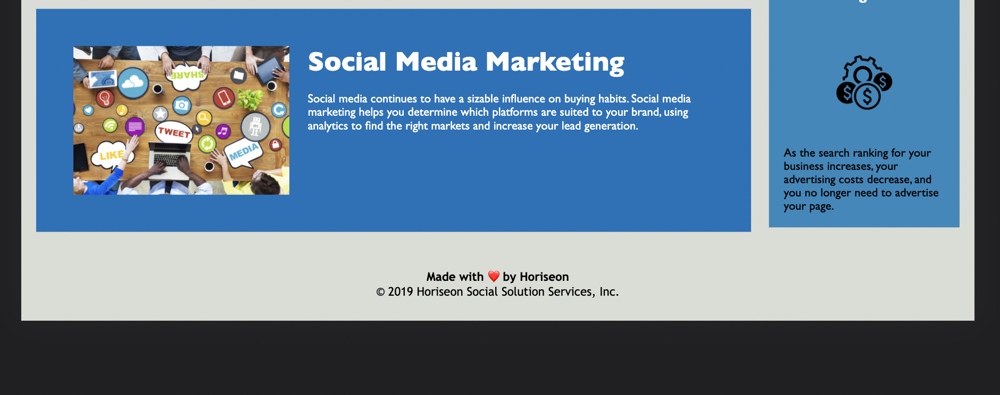

# Semantic-Html-refactor

- Refactor an html page using Semantic HTML
  -Changed the title

- I have added semantic HTML tags and linked the css style page

## Deployed URL

-you can find the link to the website [here](https://estera09-ux.github.io/Semantic-Html-refactor/)

## Screenshots

# Before

# After

## Technologies used

- html
  -css
